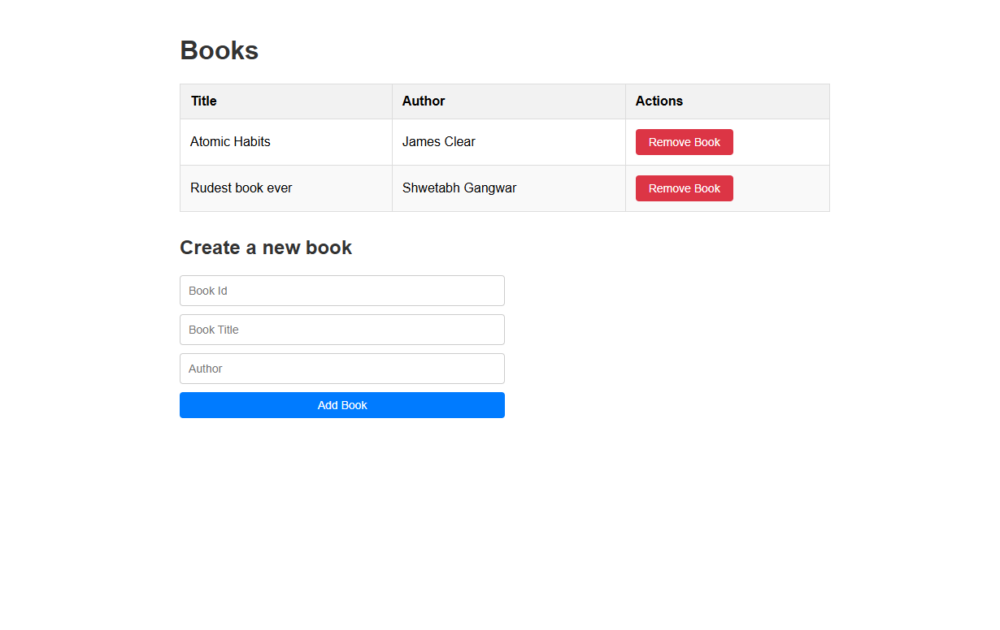

# Book Management System

A simple Angular application for managing a collection of books using NgRx for state management.



## Features

- **View Books**: Display a list of books in a table format showing title and author.
- **Add Books**: Add new books to the collection with ID, title, and author.
- **Remove Books**: Delete books from the collection by ID.
- **State Management**: Uses NgRx Store and Effects for predictable state management.
- **Reactive UI**: Built with Angular's reactive components and RxJS observables.

## Technologies Used

- **Angular 19**: Framework for building the web application.
- **NgRx Store**: For managing application state.
- **NgRx Effects**: For handling side effects like API calls.
- **RxJS**: For reactive programming and handling asynchronous operations.
- **TypeScript**: For type-safe development.
- **Angular CLI**: For project scaffolding and build tools.

## Project Structure

```
src/
├── app/
│   ├── app.component.*          # Root component
│   ├── app.config.ts            # Application configuration
│   ├── app.routes.ts            # Routing configuration
│   ├── app.state.ts             # Global state setup
│   ├── book-list/               # Book list component
│   │   ├── book-list.component.*
│   ├── books/                   # Books feature module
│   │   ├── book.actions.ts      # NgRx actions
│   │   ├── book.effects.ts      # NgRx effects
│   │   ├── book.reducer.ts      # NgRx reducer
│   │   ├── book.service.ts      # Book service
│   └── models/
│       └── book.ts              # Book interface
```